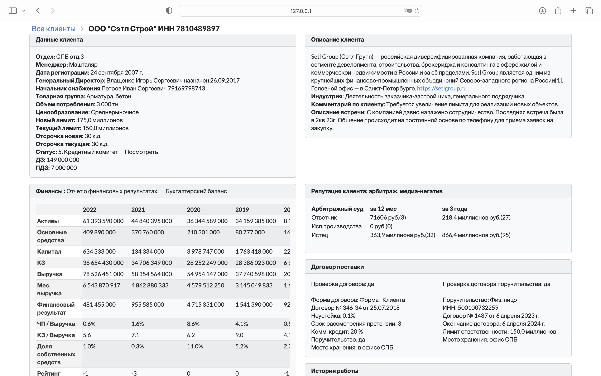
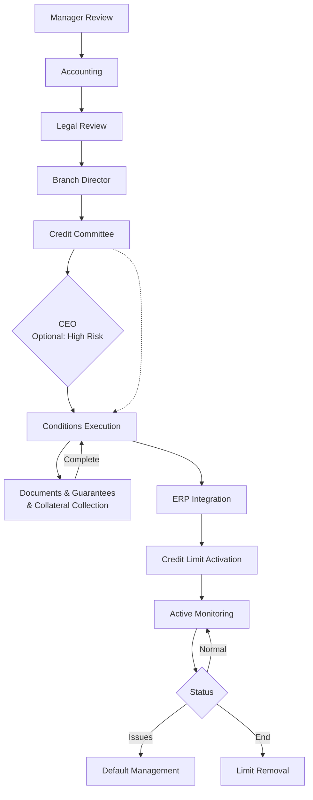
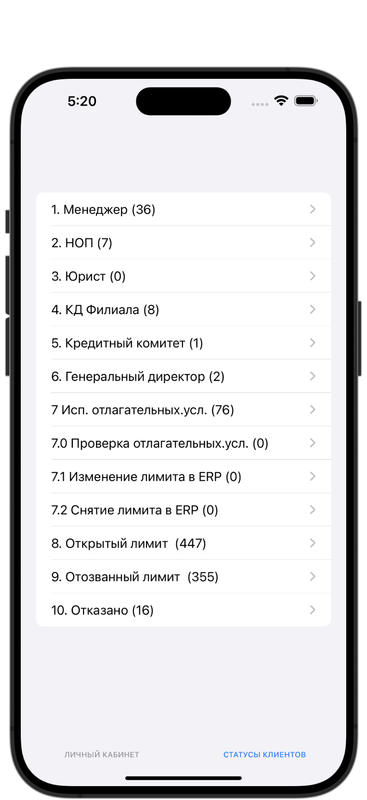
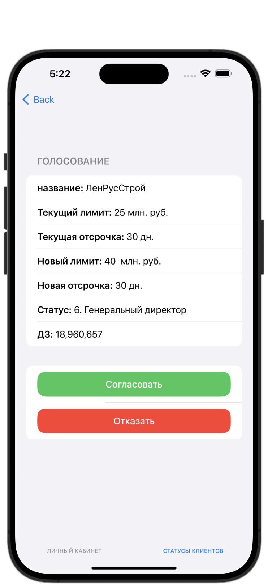

# Credit Application Management System

<p align="center">
  
</p>

<p align="center">
  <strong>Enterprise-grade credit workflow management platform for real sector business</strong>
</p>

<p align="center">
  
  
  
  
  
  
  
</p>

**[Overview](#overview)** | **[Features](#features)** | **[Architecture](#architecture)** | **[Technology Stack](#technology-stack)** | **[Security](#security)** | **[Deployment](#deployment)** | **[Multi-Branch Support](#multi-branch-support)** | **[Project Structure](#project-structure)** | **[Performance Considerations](#performance-considerations)** | **[Development](#development)**

---

## Overview

A sophisticated **Django-based credit application management system** designed for real sector businesses with credit risk exposure. This platform streamlines the entire credit lifecycle—from initial application through multi-level approval workflows to post-approval monitoring—while providing real-time notifications across web and mobile channels.

<!-- Add screenshot: Dashboard overview -->
<p align="center">
  
</p>

### Key Metrics

| Metric | Value |
|--------|-------|
| Django Applications | 3 core modules |
| Data Models | 30+ entities |
| API Endpoints | 120+ routes |
| Approval Stages | 13-step workflow |
| Mobile API Endpoints | 15 dedicated routes |
| Helper Functions | 1,969 lines of integration logic |

---

## Features

### Multi-Stage Approval Workflow

A comprehensive 12-stage credit approval pipeline with role-based routing:



Each stage features:
- **Role-based access control** — Only authorized personnel can approve/reject
- **Audit trail** — Complete history of status changes with timestamps
- **Automatic notifications** — Email and push alerts on status transitions
- **Override requests** — Voting system for credit limit exceptions

### Real-Time Notification Engine

Multi-channel notification delivery powered by Django Channels and Firebase:

```python
# WebSocket connection for instant updates
# Firebase Cloud Messaging for mobile push
```

- **WebSocket consumers** for live dashboard updates
- **Redis channel layer** for scalable message broadcasting
- **Firebase FCM** integration for iOS/Android push notifications
- **Per-user preferences** — Granular control over notification types

### External Data Integration

Seamless integration with **Kontur Focus API** for automated financial data enrichment:

| Data Type | Source |
|-----------|--------|
| Company Registration | EGRUL/EGRIP |
| Financial Statements | Rosstat |
| Court Cases | Arbitration Courts |
| Tax Information | FNS |
| Shareholder Structure | SPARK |

```python
# Example: Fetch comprehensive company data
get_kontur_basics(inn)      # Registration, OKVED, executives
get_kontur_financials(inn)  # Balance sheet, income statement
get_kontur_trials(inn)      # Litigation history
```

### Mobile-First API Layer

Dedicated REST API designed for native mobile applications:

<!-- Mobile app screenshots -->
<p align="center">
  
  
</p>


### Document Management

Enterprise document handling with version control:

- **Secure file uploads** with automatic organization
- **Auto-cleanup** on document/client deletion
- **Access control** — Documents inherit client permissions
- **Version history** via status tracking

---

## Architecture


### Application Modules

#### Clients Module
The core business logic engine handling credit workflows:

```python
# 30+ models including:
ClientsModel          # Core client entity with 14 status stages
Department            # Multi-branch organization
Employees             # Manager/Director hierarchy
ClientFinances        # Multi-year financial statements
ClientContract        # Loan agreements and terms
OverLimitRequestModel # Credit limit override requests
```

#### Swift Module
Mobile API layer with Firebase Cloud Messaging for push notifications:

- Dedicated REST API endpoints for iOS and Android clients
- Real-time push notifications via Firebase Cloud Messaging (FCM)
- Device token management for targeted notifications
- Multi-platform support (Swift/Kotlin)


### Data Flow

```
┌─────────────┐
│   Kontur    │
│   Focus     │──────┐
│     API     │      │
└─────────────┘      │
                     ▼
              ┌──────────────┐
              │    Django    │
              │   Business   │───────────────┐
              │    Logic     │               │
              └──────┬───────┘               │
                     │                       │
              ┌──────┼──────┐                │
              │      │      │                │
              ▼      ▼      ▼                ▼
        ┌──────────┐ ┌─────────┐ ┌──────────────┐
        │  Redis   │ │   FCM   │ │  Swift/      │
        │  Cache   │ │ Notifier│ │  Kotlin      │
        │          │ │         │ │  Mobile App  │
        └──────────┘ └────┬────┘ └──────────────┘
                          │             ▲
                          └─────────────┘
                              Push Notifications
```

**Flow Description:**
1. **Data Ingestion**: Kontur Focus API financial data → Django backend
2. **Caching**: Redis caches frequently accessed data and session state
3. **Notifications**: FCM sends push notifications to mobile devices
4. **API Layer**: Django REST endpoints serve data to mobile clients
5. **Mobile Rendering**: Swift/Kotlin apps consume JSON responses and render UI

---

## Technology Stack

### Backend
| Technology | Purpose |
|------------|---------|
| Django | Web framework |
| Django REST Framework | API layer |
| Django Channels | WebSocket support |
| Celery | Background tasks |

### Data Layer
| Technology | Purpose |
|------------|---------|
| PostgreSQL | Primary database |
| Redis | Cache, sessions, channel layer |
| Pandas | Data processing |
| OpenPyXL | Excel export |

### Infrastructure
| Technology | Purpose |
|------------|---------|
| Docker & Compose | Containerization |
| Nginx | Reverse proxy, SSL |
| Prometheus | Metrics collection |
| Grafana Promtail | Log aggregation |

### Integrations
| Service | Purpose |
|---------|---------|
| Kontur Focus API | Financial data enrichment |
| Firebase Admin SDK | Push notifications |
| YooKassa | Payment processing |

---

## Security

### Authentication & Authorization

```python
# Role-based access control
class ManagerRequiredMixin(UserPassesTestMixin):
    def test_func(self):
        return self.request.user.groups.filter(
            name__in=['XXX', 'XXX', 'XXX', 'XXX', 'XXX']
        ).exists()
```

**Access Control Groups:**
- `XXX` — Full client management
- `XXX` — Risk assessment specialists
- `XXX` — Legal department review
- `XXX` — Financial verification
- `XXX` — Branch directors
- `XXX` — Administrative staff

### Infrastructure Security

- **SSL/TLS encryption** via Nginx with certificates
- **Password-protected Redis** for cache and sessions
- **CSRF protection** with trusted origins configuration
- **Secure password reset** with time-limited tokens
- **Basic authentication** layer for admin interfaces


---

## Deployment

### Docker Compose Architecture

```yaml
services:
  credit_app:     # Django application
  nginx:          # Reverse proxy (80/443)
  redis:          # Message broker & cache
  promtail:       # Log aggregation
  node-exporter:  # System metrics
```

---

## Multi-Branch Support

The system supports hierarchical organization structure:

```
Head Office
├── Moscow (МСК)
├── Saint Petersburg (СПБ)
├── Taganrog (ТГН)
├── Samara (СМР)
├── Saratov (СРТ)
├── Krasnodar (КРД)
└── Projects Division (ПРОЕКТЫ)
```

Each branch has:
- **Dedicated managers** with branch-scoped access
- **Branch directors** for approval authority
- **Separate notification channels**
- **Branch-level reporting**

---

## Project Structure

```
credit-app/
├── clients/                    # Core credit management module
│   ├── models.py              # 30+ data models
│   ├── views.py               # 40+ views 
│   ├── helpers.py             # Kontur API integration
│   ├── admin.py               # Admin interface configuration
│   ├── serializers.py         # DRF serializers
│   └── templates/             # 40+ HTML templates
│
├── swift/                      # Mobile API & real-time module
│   ├── views.py               # API endpoints
│   ├── consumers.py           # WebSocket consumers
│   ├── routing.py             # WebSocket URL routing
│   └── models.py              # Device & notification settings
│
├── users/                      # Authentication & payments
│   ├── views.py               # Auth, payment views
│   ├── forms.py               # Registration, login forms
│   └── models.py              # User, tariff, payment models
│
├── django_project/             # Django configuration
│   ├── settings.py            # Application settings
│   ├── urls.py                # URL routing
│   ├── asgi.py                # ASGI configuration (Channels)
│   └── wsgi.py                # WSGI configuration
│
├── static/                     # Static assets (CSS, JS, images)
├── Documents/                  # File uploads & logs
├── conf/                       # Nginx configuration
│
├── docker-compose.yml          # Container orchestration
├── Dockerfile                  # Application container
├── requirements.txt            # Python dependencies
└── manage.py                   # Django management script
```

---

## Performance Considerations

### Database Optimization

```python
# Efficient queryset with select_related
clients = ClientsModel.objects.select_related(
    'department', 'manager', 'director'
).prefetch_related(
    'clientfinances_set', 'clientdocuments_set'
).filter(status__in=active_statuses)
```

### Caching Strategy

```python
# Redis caching for frequently accessed data
from django.core.cache import cache

def get_department_stats(department_id):
    cache_key = f'dept_stats_{department_id}'
    stats = cache.get(cache_key)
    if stats is None:
        stats = compute_department_statistics(department_id)
        cache.set(cache_key, stats, timeout=300)  # 5 minutes
    return stats
```

### Background Processing

```python
# Async notification delivery
async def send_batch_notifications(user_ids, message):
    async with aiohttp.ClientSession() as session:
        tasks = [
            send_fcm_notification(session, uid, message)
            for uid in user_ids
        ]
        await asyncio.gather(*tasks)
```

---

## Development


### Running Tests

```bash
# Run all tests
python manage.py test

# Run specific app tests
python manage.py test clients

# Run with coverage
coverage run manage.py test
coverage report
```

---


## License

This project is [proprietary software](https://www.credit-app.ru/view_document/9/3/). All rights reserved.

---
