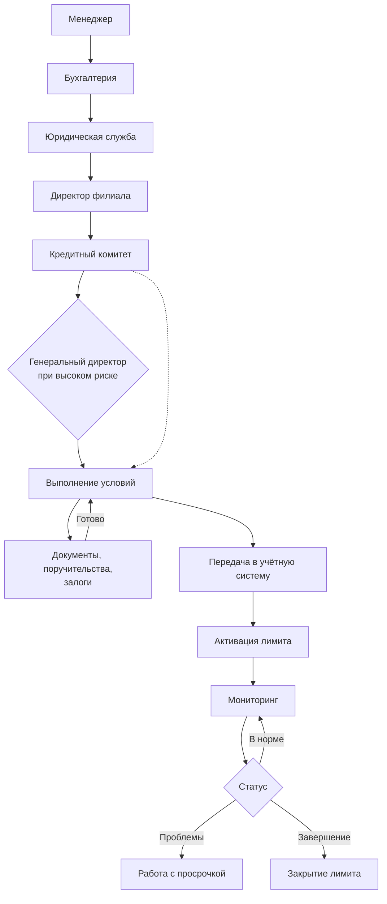

# Система управления долговыми заявками

<p align="center">
  
</p>

<p align="center">
  <strong>Платформа, которая превращает выдачу товарных кредитов из хаоса в управляемый процесс</strong>
</p>

<p align="center">
  <em>Для компаний реального сектора, которые продают с отсрочкой платежа</em>
</p>

**[О платформе](#о-платформе)** | **[Проблема](#проблема-которую-мы-решаем)** | **[Возможности](#возможности)** | **[Результаты](#что-получает-бизнес)** | **[Для кого](#для-кого)** | **[Связаться](#связаться-с-нами)**

---

## О платформе

Каждая отгрузка с отсрочкой платежа — это кредит, который вы выдаёте клиенту. И как любой кредит, он требует оценки, согласования и контроля.

Наша платформа ведёт заявку от первого обращения клиента до закрытия лимита: собирает данные о контрагенте, проводит её через все этапы согласования, уведомляет ответственных в реальном времени и не даёт ни одной заявке потеряться.

<p align="center">
  
</p>

---

## Проблема, которую мы решаем

| Как обычно | Как с платформой |
|------------|------------------|
| Заявки живут в почте, чатах и Excel | Единое окно: вся история в одном месте |
| Согласование растягивается на недели | Каждый этап с ответственным и сроком |
| Проверка контрагента вручную, по 5 сайтам | Данные подтягиваются автоматически |
| «А кто это одобрил?» — никто не помнит | Полный журнал решений с датами и именами |
| Просрочка обнаруживается постфактум | Контроль лимитов и статусов онлайн |

---

## Возможности

### Прозрачный маршрут согласования

Заявка проходит выстроенную цепочку — от менеджера до кредитного комитета и генерального директора. Каждый участник видит только то, что относится к его зоне ответственности, и не может пропустить свой шаг.



На каждом этапе:
- **Только свои полномочия** — решение принимает тот, кто вправе его принять
- **Полная история** — кто, что и когда изменил
- **Автоматические уведомления** — участники узнают о своём шаге сразу
- **Голосование по исключениям** — превышение лимита согласуется коллегиально

### Уведомления, которые доходят

Решение по заявке не ждёт, пока кто-то откроет почту. Ответственный получает уведомление на телефон и видит обновление на экране в тот же момент. Каждый сотрудник сам настраивает, о чём его уведомлять.

### Проверка контрагента без ручной работы

Вводите ИНН — платформа сама собирает досье на компанию:

| Что проверяем | Откуда |
|---------------|--------|
| Регистрационные данные | ЕГРЮЛ / ЕГРИП |
| Финансовая отчётность | Росстат |
| Судебные дела | Арбитражные суды |
| Налоговая информация | ФНС |
| Структура собственников | СПАРК |

Менеджер тратит минуты вместо часов, а решение принимается на полных данных.

### Работа с телефона

Руководитель согласует заявку из машины, с объекта или в командировке. Мобильное приложение для iPhone и Android — со списком заявок, карточкой клиента и голосованием в один тап.

<p align="center">
  
  
</p>

### Документы под контролем

Договоры, поручительства, залоговые документы — всё хранится в карточке клиента, доступно только тем, у кого есть права, и не теряется при передаче дел.

---

## Что получает бизнес

**Быстрее решения.** Заявка не лежит в чужом почтовом ящике — маршрут и уведомления не дают ей остановиться.

**Меньше потерь.** Просроченная дебиторка видна на ранней стадии, а не в конце квартала.

**Дисциплина вместо договорённостей.** Лимиты соблюдаются, исключения согласуются коллегиально и фиксируются.

**Готовность к проверке.** По любой заявке за прошлый год видно, кто принял решение и на каких данных.

**Масштаб без роста штата.** Больше заявок проходит через тот же отдел.

---

## Для кого

Платформа создана для компаний, которые отгружают товар или оказывают услуги с отсрочкой платежа:

- Оптовая торговля и дистрибуция
- Производство с сетью дилеров
- Строительство и поставка материалов
- Лизинг и товарное финансирование
- Любой бизнес с портфелем дебиторской задолженности

### Работа филиальной сети

Единая платформа для распределённой компании: головной офис видит портфель целиком, филиал — свою зону.

```
Головной офис
├── Москва
├── Санкт-Петербург
├── Таганрог
├── Самара
├── Саратов
├── Краснодар
└── Проектное направление
```

Каждый филиал работает со своими клиентами, директор филиала согласует в пределах своих полномочий, отчётность собирается и по филиалу, и по компании.

---

## Надёжность и безопасность

- Доступ к данным строго по ролям — сотрудник видит только своих клиентов
- Защищённое соединение и шифрование данных
- Полный журнал действий: ни одно изменение не проходит бесследно
- Размещение в контуре компании или в защищённом облаке

---

## Связаться с нами

Покажем платформу на ваших процессах и оценим, что изменится в цифрах.

**[credit-app.ru](https://www.credit-app.ru/)**

---

## Правовая информация

Программное обеспечение является [проприетарным](https://www.credit-app.ru/view_document/9/3/). Все права защищены.

---
